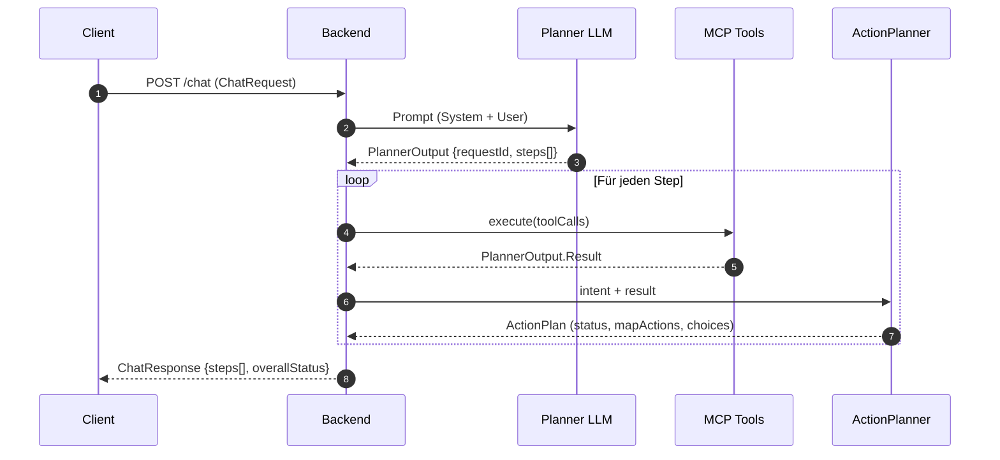

# ask.sogis

ask.sogis ist ein Experiment für einen kartenbasierten Copiloten. Die Anwendung
besteht aus einem SvelteKit-Client (Ordner `client/`) und einem Spring Boot MCP
Backend (Ordner `mcp/`).

## Multi-Step-Responses

Jede Chat-Anfrage (`ChatRequest`) enthält eine Session-ID sowie die Nachricht des
Users. Der Planner (LLM) darf mehrere Schritte pro Nachricht erzeugen. Ein
Schritt entspricht genau einem Intent (z. B. Adresse zentrieren und danach einen
Layer laden). Der `ChatOrchestrator` führt die vom Planner vorgeschlagenen
ToolCalls sequenziell aus und bildet für jeden Intent ein eigenes
Antwortsegment. Der Client kann die resultierenden MapActions anschließend in
Reihenfolge anwenden.

```json
{
  "requestId": "req-88",
  "steps": [
    {
      "intent": "goto_address",
      "status": "ok",
      "message": "Adresse Langendorfstrasse 19b zentriert.",
      "mapActions": [
        { "type": "setView", "payload": { "center": [2609767.1, 1228437.4], "zoom": 17, "crs": "EPSG:2056" } },
        { "type": "addMarker", "payload": { "id": "addr-7568", "coord": [2609767.1, 1228437.4], "style": "pin-default" } }
      ],
      "choices": []
    },
    {
      "intent": "load_layer",
      "status": "ok",
      "message": "Gewässerschutz-Layer geladen.",
      "mapActions": [
        { "type": "addLayer", "payload": { "id": "ch.sg.gws", "type": "wmts", "source": { "url": "…" }, "visible": true } }
      ],
      "choices": []
    }
  ],
  "overallStatus": "ok"
}
```

Der Gesamtstatus (`overallStatus`) ist die schwerwiegendste Bewertung aller
Steps (`error` > `needs_clarification` > `needs_user_choice` > `ok`).

## JSON-Vertrag zwischen Client und Server

Der Chat-Endpunkt (`POST /chat`) verarbeitet eine `ChatRequest` und liefert
eine `ChatResponse`. Beide Objekte sind JSON-kodiert und strikt darauf
ausgelegt, dass der Client Map-Aktionen sofort anwenden oder dem User eine
wahlpflichtige Liste präsentieren kann.

### Anfrage (`ChatRequest`)

```json
{
  "sessionId": "user-42",          // Pflicht, Gesprächs- und Choice-Kontext
  "userMessage": "Lade die ÖREB-Auszüge für die Parzelle 1234",
  "choiceId": "oereb-1"            // Optional: Antwort auf needs_user_choice
}
```

* `sessionId` verknüpft Planner-, MCP- und Choice-Context über mehrere
  Nachrichten hinweg.
* `choiceId` ist nur gesetzt, wenn der Client einen zuvor gelieferten
  `needs_user_choice` bestätigt. In diesem Fall wird der hinterlegte Kontext
  wieder aufgenommen und der nächste ToolCall mit der ausgewählten Option
  ausgeführt.

### Antwort (`ChatResponse`)

```json
{
  "requestId": "req-88",             // korreliert Anfrage und Antwort
  "overallStatus": "needs_user_choice",
  "steps": [
    {
      "intent": "goto_address",     // IntentType
      "status": "ok",               // ok | needs_user_choice | needs_clarification | error
      "message": "Adresse zentriert.",
      "mapActions": [                // vom Client sequentiell ausführbar
        { "type": "setView", "payload": { "center": [2609767.1, 1228437.4], "zoom": 17, "crs": "EPSG:2056" } },
        { "type": "addMarker", "payload": { "id": "addr-7568", "coord": [2609767.1, 1228437.4], "style": "pin-default" } }
      ],
      "choices": []                  // nur bei needs_user_choice gefüllt
    }
  ]
}
```

* `mapActions` sind generische Kartenbefehle (`type` + `payload`), die der
  Client direkt an seine Map-API durchreichen kann. Die ActionPlanner-Templates
  stellen sicher, dass jede Intent-Antwort sofort ausführbar ist.
* `choices` liefert interaktive Optionen mit ID, Label, Confidence und ggf.
  vorgefertigten `mapActions` (z. B. Marker zur Auswahlvorschau).
* `overallStatus` entspricht der schwerwiegendsten Step-Bewertung und steuert
  den UI-Zustand (z. B. Fehlermeldung oder Dialog zur Auswahlpflicht).

### Statusfälle

* **`ok`** – Der Intent ist abgeschlossen und liefert sofort auszuführende
  `mapActions`. Beispiel: Genau ein Geocode-Treffer, Layer erfolgreich geladen.
* **`needs_user_choice`** – Mehrere Kandidaten oder bewusst eingeforderte
  Auswahl. `choices` enthält mindestens zwei Optionen mit IDs; der Client zeigt
  einen Dialog an und sendet die ausgewählte `choiceId` in einer Folgeanfrage.
* **`needs_clarification`** – Der Planner benötigt zusätzliche Informationen
  (z. B. fehlende Attribute). Es gibt weder `mapActions` noch `choices`; der
  Client fordert den User mit `message` zur Präzisierung auf.
* **`error`** – Verarbeitung schlug fehl; keine `mapActions`/`choices`.

### Warum dieser Vertrag?

* **Deterministische UI-Reaktion**: Jeder Step trägt einen Status, Message und
  ausführbare `mapActions`, sodass der Client ohne weitere Logik zwischen
  „sofort anwenden“, „User muss wählen“ oder „User muss nachliefern“
  unterscheiden kann.
* **Mehrschritt-Unterstützung**: Mehrere Intents pro Anfrage werden als Steps
  geliefert. Der Client kann sie nacheinander abspielen, während
  `overallStatus` den gravierendsten Zustand widerspiegelt.
* **Konsistenter Choice-Flow**: `needs_user_choice` kapselt mehrdeutige
  Planner-/MCP-Resultate. Die Auswahl wird serverseitig im Choice-Kontext
  gespeichert und bei der Folgennachricht (`choiceId`) wieder aufgenommen,
  sodass der Client keine Zwischenschritte rekonstruieren muss.
* **Map-API-Agnostik**: `mapActions` bestehen nur aus `type` + `payload` und
  sind damit transportfähig, unabhängig von der konkreten Client-Implementierung.

## Sequenzdiagramm



## Entwicklung & Tests

Der MCP-Server wird mit Gradle gebaut. Typische Kommandos:

```bash
cd mcp
./gradlew test
./gradlew bootRun
```

Bitte alle relevanten Tests vor Commits ausführen. Für UI-Anpassungen im
SvelteKit-Client stehen Playwright-Tests (`npm run test:e2e`) bereit.
