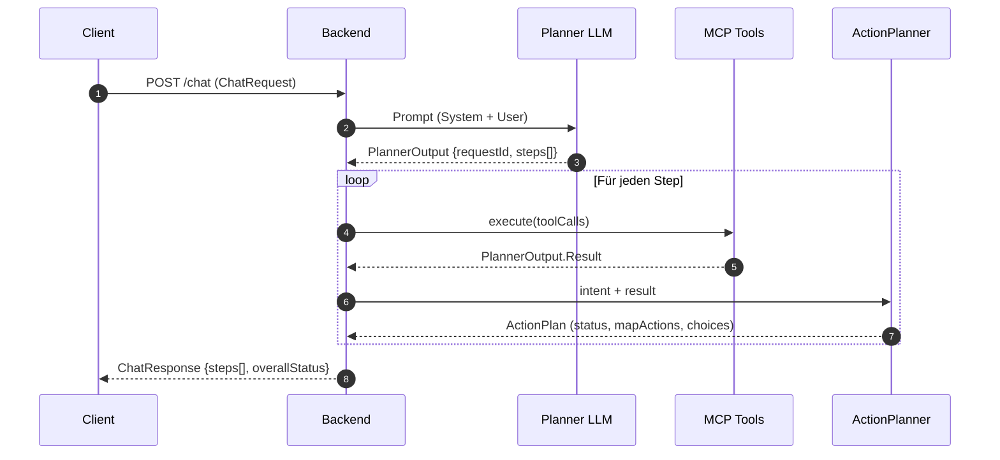

# ask.sogis

ask.sogis ist ein Experiment für einen kartenbasierten Copiloten. Die Anwendung
besteht aus einem SvelteKit-Client (Ordner `client/`) und einem Spring Boot MCP
Backend (Ordner `mcp/`).

## Multi-Step-Responses

Jede Chat-Anfrage (`ChatRequest`) enthält eine Session-ID sowie die Nachricht des
Users. Der Planner (LLM) darf mehrere Schritte pro Nachricht erzeugen. Ein
Schritt entspricht genau einem Intent (z. B. Adresse zentrieren und danach einen
Layer laden). Der `ChatOrchestrator` führt die vom Planner vorgeschlagenen
ToolCalls sequenziell aus und bildet für jeden Intent ein eigenes
Antwortsegment. Der Client kann die resultierenden MapActions anschließend in
Reihenfolge anwenden.

```json
{
  "requestId": "req-88",
  "steps": [
    {
      "intent": "goto_address",
      "status": "ok",
      "message": "Adresse Langendorfstrasse 19b zentriert.",
      "mapActions": [
        { "type": "setView", "center": [2609767.1, 1228437.4], "zoom": 17, "crs": "EPSG:2056" },
        { "type": "addMarker", "id": "addr-7568", "coord": [2609767.1, 1228437.4], "style": "pin-default" }
      ],
      "choices": []
    },
    {
      "intent": "load_layer",
      "status": "ok",
      "message": "Gewässerschutz-Layer geladen.",
      "mapActions": [
        { "type": "addLayer", "id": "ch.sg.gws", "layerType": "wmts", "source": { "url": "…" }, "visible": true }
      ],
      "choices": []
    }
  ],
  "overallStatus": "ok"
}
```

Der Gesamtstatus (`overallStatus`) ist die schwerwiegendste Bewertung aller
Steps (`error` > `needs_clarification` > `needs_user_choice` > `ok`).

## Sequenzdiagramm



## Entwicklung & Tests

Der MCP-Server wird mit Gradle gebaut. Typische Kommandos:

```bash
cd mcp
./gradlew test
./gradlew bootRun
```

Bitte alle relevanten Tests vor Commits ausführen. Für UI-Anpassungen im
SvelteKit-Client stehen Playwright-Tests (`npm run test:e2e`) bereit.
