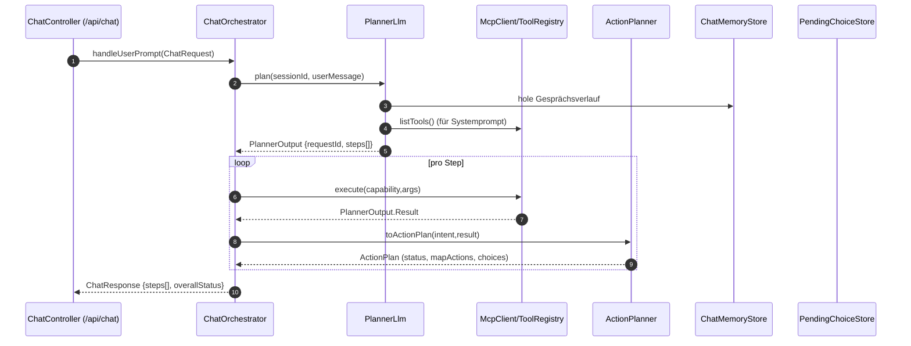
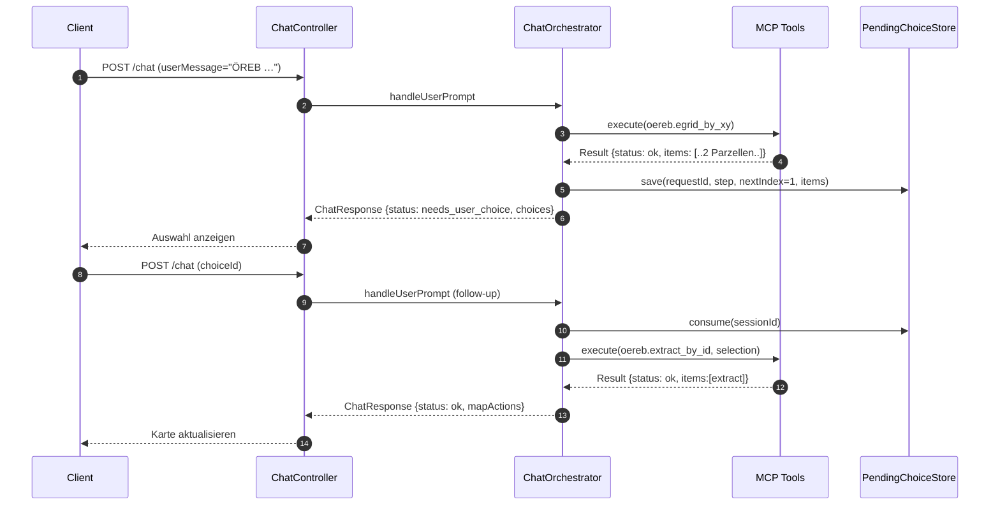
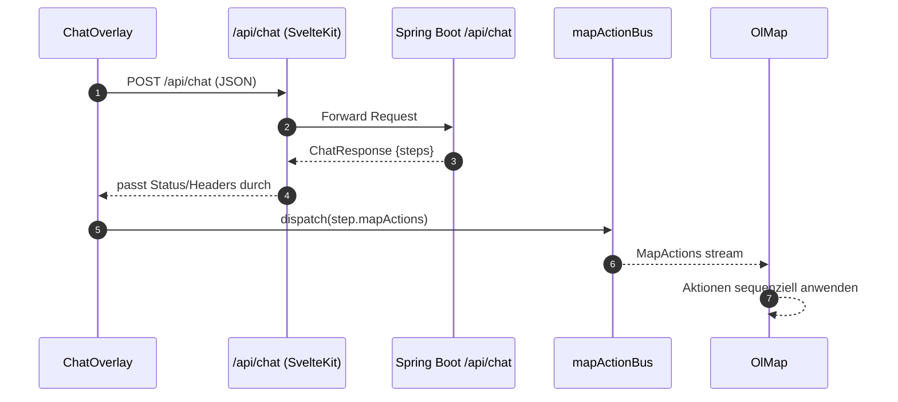

# Architektur- und Flow-Dokumentation

Diese Seite beschreibt die Request/Response-Abläufe der Anwendung. Der Fokus liegt zuerst auf den Serverpfaden, danach auf den clientseitigen Interaktionen und der MCP-Tool-Registrierung.

## Server-Abläufe (High Level)



### Server-Komponenten
- **ChatController**: REST-Endpunkt `/api/chat`; ruft `ChatOrchestrator` für POST/DELETE auf und liefert JSON-`ChatResponse` zurück.
- **ChatOrchestrator**: Steuert den kompletten Ablauf pro Nachricht, führt ToolCalls aus, hält Zwischenresultate fest und aggregiert den `overallStatus`.
- **PlannerLlm**: Baut den Systemprompt (inkl. aller verfügbaren MCP-Tools), bestimmt den Intent (siehe Enum `IntentType`) und liefert den strukturierten `PlannerOutput` mit Steps/ToolCalls.
- **McpClient**: Dünne Schicht zum `ToolRegistry`; führt die vom Planner vorgeschlagenen Capabilities aus.
- **ActionPlanner**: Wandelt MCP-Ergebnisse in MapActions/Choices um und setzt pro Step den Status (`ok`, `needs_user_choice`, `needs_clarification`, `error`).
- **ChatMemoryStore**: Persistiert Nachrichtenhistorie pro Session, damit Planner-LLM Kontext hat und Tool-Ergebnisse protokolliert werden.
- **PendingChoiceStore**: Serverseitiger Zwischenspeicher, der Choice-Kontext (Request, Step, Index, Items) festhält, bis der User eine Option zurückmeldet.

## Request/Response-Flows mit Zwischenresultaten

### Einfacher Intent: „Gehe zur Langendorfstrasse 19b in Solothurn“
1) **PlannerLlm** erzeugt einen Plan mit einem Step `goto_address` und einem ToolCall (`geolocation.geocode`) mit der vollständigen Adresse. `result.status = "pending"`.
2) **ChatOrchestrator** führt den ToolCall aus. Das MCP-Resultat liefert z. B. `status = ok`, `items = [{ id, label, coord, crs }]`. Die Entscheidung fällt sofort, weil genau ein Item vorliegt.
3) **ActionPlanner** wandelt das Item in MapActions um (z. B. `setView` + `addMarker`) und setzt `status = ok`, `choices = []`.
4) **ChatResponse** enthält einen Step mit `status = ok`; `overallStatus = ok`.

```json
{
  "requestId": "req-geo-01",
  "overallStatus": "ok",
  "steps": [
    {
      "intent": "goto_address",
      "status": "ok",
      "message": "Adresse Langendorfstrasse 19b zentriert.",
      "mapActions": [
        { "type": "setView", "payload": { "center": [2609767.1, 1228437.4], "zoom": 17, "crs": "EPSG:2056" } },
        { "type": "addMarker", "payload": { "id": "addr-7568", "coord": [2609767.1, 1228437.4], "style": "pin-default", "label": "Langendorfstrasse 19b, 4500 Solothurn" } }
      ],
      "choices": []
    }
  ]
}
```

### Mehrschritt-Intent: „Gehe zur Langendorfstrasse 19b in Solothurn und lade den Gewässerschutzlayer“
1) **PlannerLlm** liefert zwei Steps in Reihenfolge: (a) `goto_address` mit `geolocation.geocode`, (b) `load_layer` mit `layers.search` (Arg `query="Gewässerschutz"`). Beide `result.status = pending`.
2) **ChatOrchestrator** arbeitet Step für Step ab:
   - Step 1: MCP liefert genau einen Treffer ⇒ `ActionPlanner` setzt `mapActions = [setView, addMarker]`, `status = ok`.
   - Step 2: MCP findet passenden Layer ⇒ `mapActions = [addLayer]`, `status = ok`.
3) **ChatResponse** bündelt beide Steps; `overallStatus = ok`, weil bei der Statusaggregation nur der „schwerwiegendste“ Zustand (Reihenfolge: `error` > `needs_clarification` > `needs_user_choice` > `ok`) gewählt wird und hier alle Steps auf `ok` stehen.

```json
{
  "requestId": "req-geo-layer-02",
  "overallStatus": "ok",
  "steps": [
    {
      "intent": "goto_address",
      "status": "ok",
      "message": "Adresse Langendorfstrasse 19b zentriert.",
      "mapActions": [
        { "type": "setView", "payload": { "center": [2609767.1, 1228437.4], "zoom": 17, "crs": "EPSG:2056" } },
        { "type": "addMarker", "payload": { "id": "addr-7568", "coord": [2609767.1, 1228437.4], "style": "pin-default", "label": "Langendorfstrasse 19b, 4500 Solothurn" } }
      ],
      "choices": []
    },
    {
      "intent": "load_layer",
      "status": "ok",
      "message": "Gewässerschutz-Layer geladen.",
      "mapActions": [
        { "type": "addLayer", "payload": { "id": "ch.so.gws", "type": "wmts", "source": { "url": "https://wmts.example/gws" }, "visible": true } }
      ],
      "choices": []
    }
  ]
}
```
3) **ChatResponse** bündelt beide Steps; `overallStatus = ok` (schwerwiegendster Status über alle Steps).

### Auswahl-Flow (needs_user_choice): „Lade den ÖREB-Auszug an der Koordinate 2600513, 1215519“
1) **PlannerLlm** plant einen Step `oereb_extract` mit zwei ToolCalls: (a) `oereb.egrid_by_xy` (liefert betroffene Grundstücke), (b) `oereb.extract_by_id` (zieht den Auszug).
2) **ChatOrchestrator** führt ToolCall (a) aus. Das Ergebnis enthält mehrere `items` (z. B. zwei Parzellen) ⇒ der Orchestrator speichert im **PendingChoiceStore** `{ requestId, step, nextToolCallIndex=1, choiceItems=items }` und gibt ein Zwischenresultat `status = needs_user_choice`, `choices = items`, `message = "Bitte wähle …"` zurück. Der nächste ToolCall wird noch nicht ausgeführt.
3) **Client** zeigt die Auswahl an und sendet eine Folgeanfrage mit `choiceId`.
4) **ChatOrchestrator** lädt den gespeicherten Kontext, fügt die Auswahl in die Args für ToolCall (b) ein und führt diesen aus. Liefert MCP `status = ok` mit einem Item (inkl. `extractUrl`), setzt `mapActions = [setView?, addMarker?, showOerebExtract]`, `choices = []`.
5) **ChatResponse** der Folgeanfrage enthält einen Step mit `status = ok`. Der ursprüngliche `overallStatus` war `needs_user_choice`, danach `ok`.

Erste Antwort (mit Auswahl):

```json
{
  "requestId": "req-oereb-03",
  "overallStatus": "needs_user_choice",
  "steps": [
    {
      "intent": "oereb_extract",
      "status": "needs_user_choice",
      "message": "Bitte wähle das betroffene Grundstück.",
      "mapActions": [],
      "choices": [
        {
          "id": "p1",
          "label": "EGRID CH1234567891011 – Parzelle A",
          "confidence": 0.91,
          "mapActions": [
            { "type": "addMarker", "payload": { "id": "choice-p1", "coord": [2600513, 1215519], "style": "pin-default", "label": "Parzelle A" } }
          ],
          "data": { "egrid": "CH1234567891011", "coord": [2600513, 1215519] }
        },
        {
          "id": "p2",
          "label": "EGRID CH1234567891012 – Parzelle B",
          "confidence": 0.78,
          "mapActions": [
            { "type": "addMarker", "payload": { "id": "choice-p2", "coord": [2600520, 1215525], "style": "pin-default", "label": "Parzelle B" } }
          ],
          "data": { "egrid": "CH1234567891012", "coord": [2600520, 1215525] }
        }
      ]
    }
  ]
}
```

Folgeantwort nach User-Wahl (`choiceId = "p1"`):

```json
{
  "requestId": "req-oereb-03",
  "overallStatus": "ok",
  "steps": [
    {
      "intent": "oereb_extract",
      "status": "ok",
      "message": "ÖREB-Auszug für CH1234567891011 bereit.",
      "mapActions": [
        { "type": "setView", "payload": { "center": [2600513, 1215519], "zoom": 18, "crs": "EPSG:2056" } },
        { "type": "addMarker", "payload": { "id": "oereb-CH1234567891011", "coord": [2600513, 1215519], "style": "pin-default", "label": "CH1234567891011" } },
        { "type": "showOerebExtract", "payload": { "egrid": "CH1234567891011", "url": "https://oereb.example/extract/CH1234567891011.pdf" } }
      ],
      "choices": []
    }
  ]
}
```



### Status-Übersicht
- **ok**: MCP-Ergebnis mit genau einem Item; `ActionPlanner` baut MapActions und Choices bleibt leer.
- **needs_user_choice**: Mehrere Items oder MCP meldet explizit `needs_user_choice`; Orchestrator persistiert Auswahlkontext, `choices` enthält Optionen.
- **needs_clarification**: MCP/Planner fordert Präzisierung (keine Items/Actions); der Client zeigt nur die Message an.
- **error**: Fehler bei der Toolausführung oder ungültige Auswahl; keine MapActions.
- **overallStatus**: Aggregation pro Anfrage (`error` > `needs_clarification` > `needs_user_choice` > `ok`).

## Client-Abläufe
1) **ChatOverlay.svelte** sammelt Eingaben, ruft `/api/chat` (POST) mit `sessionId`, `userMessage` bzw. `choiceId` auf und zeigt Step-Messages an.
2) **Route /api/chat** (`+server.ts`) proxyt Requests/Antworten an den Spring-Boot-Backend-Endpunkt `http://localhost:8080/api/chat` (POST/DELETE) und reicht Body/Status unverändert durch.
3) **mapActionBus** (`lib/stores/mapActions.ts`) verteilt die MapActions aus der `ChatResponse` an Kartenkomponenten.
4) **OlMap.svelte** abonniert den Bus und wendet Actions sequentiell an (`setView`, `addMarker`, `addLayer`, `clearMap` …); bei neuen Sessions wird `clearMap` gesendet.



## MCP-Tools, Registry und Systemprompt
- **Registrierung**: `SpringMcpToolRegistry` scannt beim Start alle Beans nach `@McpTool`-annotierten Methoden, bildet aus Capability-ID + Description + Parametern einen `ToolDescriptor` und speichert ihn pro `McpToolCapability`.
- **Parameter-Metadaten**: `@McpToolParam` liefert Namen/Beschreibung/`required`, `@McpToolArgSchema` ergänzt optionale JSON-Schemata. Diese Metadaten landen im Descriptor.
- **Ausführung**: `McpClient` ruft `ToolRegistry.execute(...)` auf; die Registry resolved Bean/Methoden, ruft sie (mit Args) auf und normalisiert Rückgaben zu `PlannerOutput.Result` (Status, Items, Message). ToolResult-Implementierungen werden direkt übernommen.
- **Systemprompt**: `PlannerLlm.buildSystemPrompt()` holt `listTools()` aus der Registry, sortiert die Capabilities nach ID und erzeugt einen Prompt-Abschnitt mit jeder Capability, Beschreibung und den dokumentierten Parametern/Schemata. So erhält das Planner-LLM immer eine vollständige, generierte Werkzeugliste ohne manuelle Pflege.
