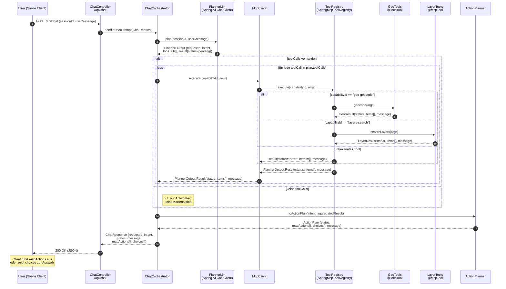

# ask.sogis

- https://www.danvega.dev/blog/cyc-mcp-server-spring-ai

## Architekturüberblick

```mermaid
sequenceDiagram
    autonumber

    participant U as User (Svelte Client)
    participant C as ChatController<br/>/api/chat
    participant O as ChatOrchestrator
    participant P as PlannerLlm<br/>(Spring AI ChatClient)
    participant M as McpClient
    participant R as ToolRegistry<br/>(SpringMcpToolRegistry)
    participant GT as GeoTools<br/>@McpTool
    participant LT as LayerTools<br/>@McpTool
    participant A as ActionPlanner

    U->>C: POST /api/chat {sessionId, userMessage}
    C->>O: handleUserPrompt(ChatRequest)

    %% 1) Planner-LLM: Intent + ToolCalls erzeugen
    O->>P: plan(sessionId, userMessage)
    P-->>O: PlannerOutput {requestId, intent,<br/>toolCalls[], result(status=pending)}

    %% 2) Orchestrator führt ToolCalls aus (MCP via ToolRegistry)
    alt toolCalls vorhanden
        loop für jede toolCall in plan.toolCalls
            O->>M: execute(capabilityId, args)
            M->>R: execute(capabilityId, args)

            alt capabilityId == "geo-geocode"
                R->>GT: geocode(args)
                GT-->>R: GeoResult(status, items[], message)
            else capabilityId == "layers-search"
                R->>LT: searchLayers(args)
                LT-->>R: LayerResult(status, items[], message)
            else unbekanntes Tool
                R-->>M: Result(status="error", items=[], message)
            end

            R-->>M: PlannerOutput.Result(status, items[], message)
            M-->>O: PlannerOutput.Result(status, items[], message)
        end
    else keine toolCalls
        note right of O: ggf. nur Antworttext,<br/>keine Kartenaktion
    end

    %% 3) ActionPlanner: Intent + Result -> MapActions / Choices
    O->>A: toActionPlan(intent, aggregatedResult)
    A-->>O: ActionPlan {status,<br/>mapActions[], choices[], message}

    %% 4) Orchestrator baut ChatResponse für den Client
    O-->>C: ChatResponse {requestId, intent,<br/>status, message,<br/>mapActions[], choices[]}
    C-->>U: 200 OK (JSON)

    note over U: Client führt mapActions aus<br/>oder zeigt choices zur Auswahl
```
