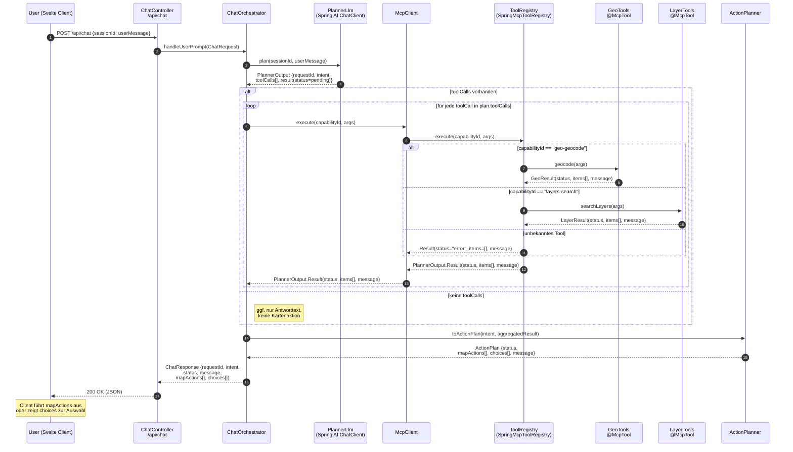

# ask.sogis

- https://www.danvega.dev/blog/cyc-mcp-server-spring-ai


## Architekturüberblick



## Kernkomponenten

### PlannerLlm
- Implementiert als Spring AI `ChatClient` und dient als erster Schritt der Verarbeitung.
- Analysiert die Benutzereingabe, extrahiert die Absicht (Intent) und schlägt benötigte Tool-Aufrufe vor.
- Gibt ein `PlannerOutput` mit `requestId`, `intent`, einer Liste von `toolCalls` sowie einem initialen `Result` (Status *pending*) zurück, wie im Sequenzdiagramm dargestellt.

### ChatOrchestrator
- Vermittelt zwischen HTTP-Controller, Planner, MCP-Client und ActionPlanner.
- Ruft zunächst `PlannerLlm.plan()` auf, orchestriert anschliessend die abgegebenen Tool-Aufrufe über den MCP-Client und aggregiert deren Ergebnisse.
- Übergibt Intent und aggregierte Ergebnisse an den ActionPlanner und baut die finale `ChatResponse` für den Client.

### ToolRegistry (SpringMcpToolRegistry)
- Kapselt die registrierten MCP-Tools (z. B. GeoTools, LayerTools) und stellt sie dem MCP-Client zur Verfügung.
- Führt die vom Planner erzeugten `toolCalls` aus, validiert Parameter und erzeugt konsistente `Result`-Objekte für den Orchestrator.
- Handhabt Fehlerfälle (unbekannte Tools, fehlerhafte Parameter) und liefert entsprechende Statusinformationen zurück.

### ActionPlanner
- Übersetzt Intent und Tool-Ergebnisse in eine strukturierte `ActionPlan`-Antwort.
- Bestimmt `mapActions` (z. B. Kartenbefehle) sowie interaktive `choices`, ergänzt um Nutzerhinweise (`message`).
- Signaliert den Gesamtstatus (success, partial, error) auf Basis der gelieferten Tool-Ergebnisse.

## Typische Responses

```jsonc
{
  "requestId": "84bd",
  "intent": "show_address",
  "status": "success",
  "message": "Adresse gefunden. Soll ich hinzoomen?",
  "mapActions": [
    {
      "type": "goto_address",
      "address": "Kirchgasse 15, 8001 Zürich"
    }
  ],
  "choices": [
    {
      "id": "confirm_zoom",
      "label": "Ja, zur Adresse zoomen",
      "mapAction": {
        "type": "zoom_to_extent",
        "extent": [2685000.12, 1245000.34, 2685020.98, 1245020.11]
      }
    }
  ]
}
```

```jsonc
{
  "requestId": "f31a",
  "intent": "load_layer",
  "status": "success",
  "message": "Habe den Gewässer-Layer vorbereitet.",
  "mapActions": [
    {
      "type": "load_layer",
      "layerId": "ch.sg.gws"
    }
  ],
  "choices": []
}
```

### Interpretation durch den Client
- **MapActions**: Der Svelte-Client konsumiert sie sequenziell und führt passende Mapbox/MapLibre-Befehle aus (z. B. Zoom, Layer laden, Adresse fokussieren). Jede Aktion ist selbsterklärend typisiert und enthält die für den Client notwendigen Parameter.
- **Choices**: Optionale Alternativen, die der Client als Buttons oder Dialogoptionen anzeigt. Bei Auswahl sendet der Client eine Folgeanfrage (`userMessage`) unter Angabe der `choice.id` oder der enthaltenen `mapAction`, sodass der Orchestrator die gewünschte Interaktion fortsetzen kann.

## Frontend-Backend-Zusammenspiel
- **Svelte-Client**: Stellt die Chatoberfläche bereit, verwaltet die laufende Sitzung (`sessionId`) und verarbeitet eingehende `ChatResponse`-Nachrichten. Führt `mapActions` unmittelbar im Kartenwidget aus und zeigt `choices` zur Interaktion an. Jede Nutzeraktion löst einen POST auf `/api/chat` mit aktueller Unterhaltungshistorie aus.
- **Spring-Boot-Backend**: Bietet den REST-Endpunkt `/api/chat`, orchestriert die Kommunikation mit dem PlannerLlm, ToolRegistry und ActionPlanner. Über den MCP-Client werden deklarierte MCP-Funktionen (z. B. Geocoding, Layersuche) aufgerufen, deren Ergebnisse in strukturierte Antworten für den Client eingebettet werden.
- **MCP-Funktionen**: Sind als Spring-Beans annotiert (`@McpTool`) und liefern Domänenfunktionen wie `geo-geocode` oder `layers-search`. Der Orchestrator nutzt sie, um auf externe Geodaten oder Layer-Metadaten zuzugreifen, und übersetzt die Resultate in `mapActions` und `choices`, die der Svelte-Client versteht.
